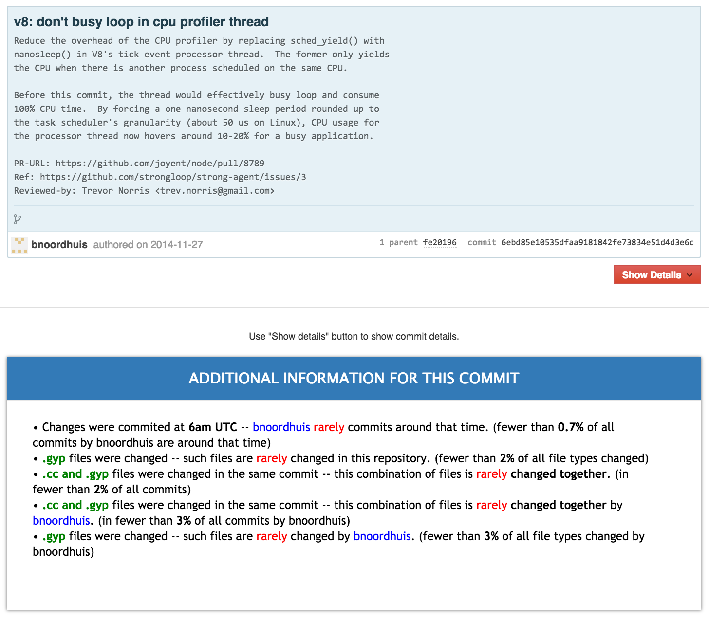
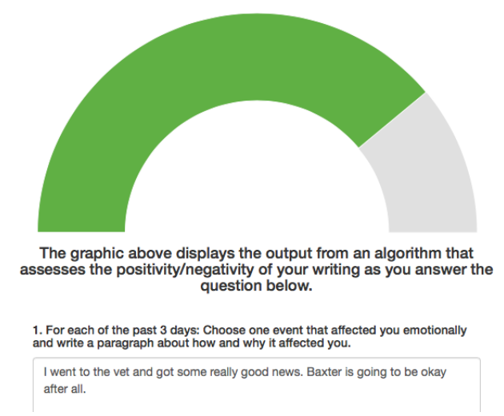
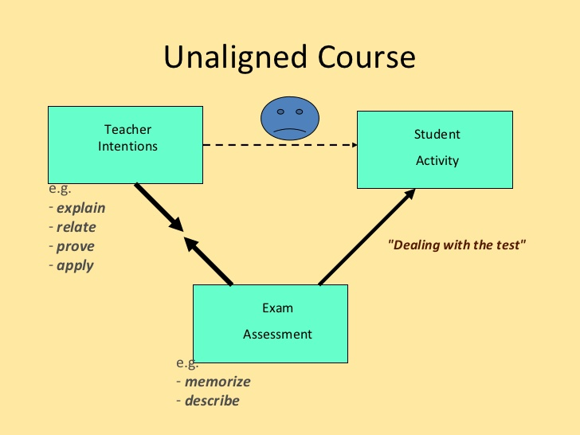

<!-- .element: class="titleslide"  data-background="../_chapterimg/19_accountability.jpg" -->
<div class="stretch"></div>

## Machine Learning in Production


# Transparency and Accountability

<!-- image: https://commons.wikimedia.org/wiki/File:Kerlikowske_testifies_before_Senate_Finance_Committee_(26349370364).jpg -->


---
## Administrativa

* Will end this lecture at 3pm
* Homework I4 (Explainability/Transparency) out tonight


----
## More Explainability, Policy, and Politics


<!-- .element: class="plain stretch" -->


----
## Readings

Required reading: 
* Google PAIR. People + AI Guidebook. Chapter: [Explainability and Trust](https://pair.withgoogle.com/chapter/explainability-trust/). 2019.

Recommendedr hoeading: 
* Metcalf, Jacob, and Emanuel Moss. "[Owning ethics: Corporate logics, silicon valley, and the institutionalization of ethics](https://datasociety.net/wp-content/uploads/2019/09/Owning-Ethics-PDF-version-2.pdf)." *Social Research: An International Quarterly* 86, no. 2 (2019): 449-476.

---
# Learning Goals

* Explain key concepts of transparency and trust
* Discuss whether and when transparency can be abused to game the system
* Design a system to include human oversight
* Understand common concepts and discussions of accountability/culpability 
* Critique regulation and self-regulation approaches in ethical machine learning


---
# Explainability vs Transparency


Explainability & Interpretability: Tools to understand the model, mostly debugging, mostly developer-focused


Transparency: Users know that algorithm exists and how the algorithm works

*Transparency is focused on users -- Human-AI interaction, oversight, appeals, audits*


----

## Recall: Explaining for Human-AI Interaction, Trust

[](nodejs-unusual-commit.png)
<!-- .element: class="stretch" -->

<!-- references_ -->
Goyal, Raman, Gabriel Ferreira, Christian Kästner, and James Herbsleb. "[Identifying unusual commits on GitHub](https://www.cs.cmu.edu/~ckaestne/pdf/jsep17.pdf)." Journal of Software: Evolution and Process 30, no. 1 (2018): e1893.

----
## Recall: Explainability for Auditing

* Understand safety implications 
* Ensure predictions use objective criteria and reasonable rules
* Inspect fairness properties
* Reason about biases and feedback loops
* Validate "learned specifications/requirements" with stakeholders

```fortran
IF age between 18–20 and sex is male THEN predict arrest
ELSE IF age between 21–23 and 2–3 prior offenses THEN predict arrest
ELSE IF more than three priors THEN predict arrest
ELSE predict no arrest
```


---
# Transparency of the Model's Existance


----

<div class="tweet" data-src="https://twitter.com/TheWrongNoel/status/1194842728862892033"></div>


----
## Case Study: Facebook's Feed Curation


<!-- .element: class="stretch" -->


<!-- references_ -->

Eslami, Motahhare, et al. [I always assumed that I wasn't really that close to [her]: Reasoning about Invisible Algorithms in News Feeds](http://eslamim2.web.engr.illinois.edu/publications/Eslami_Algorithms_CHI15.pdf). In Proc. CHI, 2015.


----
## Case Study: Facebook's Feed Curation
<!-- smallish -->

* 62% of interviewees were not aware of curation algorithm
* Surprise and anger when learning about curation

> "Participants were most upset when close friends and
family were not shown in their feeds [...] participants often attributed missing stories to their friends’ decisions to exclude them rather than to Facebook News Feed algorithm."

* Learning about algorithm did not change satisfaction level
* More active engagement, more feeling of control


<!-- references -->

Eslami, Motahhare, et al. [I always assumed that I wasn't really that close to [her]: Reasoning about Invisible Algorithms in News Feeds](http://eslamim2.web.engr.illinois.edu/publications/Eslami_Algorithms_CHI15.pdf). In Proc. CHI, 2015.


---
# Transparency of How the Model Works


----
## Enabling Oversight and Appeals


<!-- .element: class="stretch plain" -->


----
## Human-AI Interaction

<!-- colstart -->
<!-- .element: style="width:300px" -->
<!-- col -->
<!-- .element: style="width:300px" -->
<!-- col -->
Give the user details about why a prediction was made in a high stakes scenario. Here, the user is exercising after an injury and needs confidence in the app’s recommendation.
<!-- colend -->
<!-- references -->
Source:
[People + AI Guidebook](https://pair.withgoogle.com/research/), Google


----
<!-- colstart -->
<!-- .element: style="width:300px" -->


<!-- col -->
<!-- .element: style="width:300px" -->
<!-- col -->


Tell the user when a lack of data might mean they’ll need to use their own judgment. Don’t be afraid to admit when a lack of data could affect the quality of the AI recommendations.

<!-- colend -->

<!-- references -->
Source:
[People + AI Guidebook](https://pair.withgoogle.com/research/), Google


----
## Setting Cancer Imaging -- What explanations do radiologists want?


* *Past attempts often not successful at bringing tools into production. Radiologists do not trust them. Why?*
* [Wizard of oz study](https://en.wikipedia.org/wiki/Wizard_of_Oz_experiment) to elicit requirements


----


----
## Radiologists' questions


* How does it perform compared to human experts?
* "What is difficult for the AI to know? Where is it too sensitive? What criteria is it good at recognizing or not good at recognizing?"
* What data (volume, types, diversity) was the model trained on?
* "Does the AI have access to information that I don’t have? Does it have access to ancillary studies?" Is all used data shown in the UI?
* What kind of things is the AI looking for? What is it capable of learning? ("Maybe light and dark? Maybe colors? Maybe shapes, lines?", "Does it take into consideration the relationship between gland and stroma? Nuclear relationship?")
* "Does it have a bias a certain way?" (compared to colleagues)


----
## Radiologists' questions

* Capabilities and limitations: performance, strength, limitations; e.g. how does it handle well-known edge cases
* Functionality: What data used for predictions, how much context, how data is used
* Medical point-of-view: calibration, how liberal/conservative when grading cancer severity
* Design objectives: Designed for few false positives or false negatives? Tuned to compensate for human error?
* Other considerations: legal liability, impact on workflow, cost of use

<!-- references -->
Further details: [Paper, Table 1](https://dl.acm.org/doi/pdf/10.1145/3359206)


----
## Radiologists Study Insights

AI literacy important for trust

Be transparent about data used

Describe training data and capabilities

Give mental model, examples, human-relatable test cases 

Communicate the AI’s point-of-view and design goal


<!-- references -->

Cai, Carrie J., Samantha Winter, David Steiner, Lauren Wilcox, and Michael Terry. ""Hello AI": Uncovering the Onboarding Needs of Medical Practitioners for Human-AI Collaborative Decision-Making." Proceedings of the ACM on Human-computer Interaction 3, no. CSCW (2019): 1-24.


----
## Designing Transparency

Be explicit about the goal

Tailor explanation to specific user needs and user's AI literacy

Partial explanations or justifications often sufficient 

Test effectiveness of transparency mechanisms

<!-- discussion -->


---
# The Dark Side of Transparency


----
## Many explanations are wrong

Approximations of black-box models, often unstable

Explanations necessarily partial, social

Often multiple explanations possible (Rashomon effect)

Possible to use inherently interpretable models instead?

When explanation desired/required: What quality is needed/acceptable?

----
## Explanations foster Trust

Users are less likely to question the model when explanations provided
* Even if explanations are unreliable
* Even if explanations are nonsensical/incomprehensible

**Danger of overtrust and intentional manipulation**

<!-- references -->
Stumpf, Simone, Adrian Bussone, and Dympna O’sullivan. "Explanations considered harmful? user interactions with machine learning systems." In Proceedings of the ACM SIGCHI Conference on Human Factors in Computing Systems (CHI). 2016.

----


<!-- references -->
Springer, Aaron, Victoria Hollis, and Steve Whittaker. "Dice in the black box: User experiences with an inscrutable algorithm." In 2017 AAAI Spring Symposium Series. 2017.

----


(a) Rationale, (b) Stating the prediction, (c) Numerical internal values

Observation: Both experts and non-experts overtrust numerical explanations, even when inscrutable.

<!-- references -->
Ehsan, Upol, Samir Passi, Q. Vera Liao, Larry Chan, I. Lee, Michael Muller, and Mark O. Riedl. "The who in explainable AI: how AI background shapes perceptions of AI explanations." arXiv preprint arXiv:2107.13509 (2021).


----
## Illusion of Control

Users may feel influence and control, even with placebo controls


<!-- .element: class="stretch" -->

<!-- references_ -->

Vaccaro, Kristen, Dylan Huang, Motahhare Eslami, Christian Sandvig, Kevin Hamilton, and Karrie Karahalios. "The illusion of control: Placebo effects of control settings." In Proc CHI, 2018.


----
## Regulatory Compliance

Companies give vague generic explanations to appease regulators

Checkbox compliance: Provide some mechanism without ensuring effectiveness

Example: FairCredit act requires explanation for declined credit applications -- Explanations generic and ineffective for fighting discrimination, at most ensure that input data was correct


<!-- references -->
Selbst, Andrew D., and Solon Barocas. "The intuitive appeal of explainable machines." Fordham L. Rev. 87 (2018): 1085.


----
## Gaming/Attacking the Model with Explanations?

*Does providing an explanation allow customers to 'hack' the system?*

* Loan applications?
* Apple FaceID?
* Recidivism?
* Auto grading?
* Cancer diagnosis?
* Spam detection?


----
## Gaming the Model with Explanations?



<!-- .element: class="plain stretch" -->

----
## Constructive Alignment in Teaching


<!-- .element: class="plain stretch" -->

<!-- references_ -->
see also Claus Brabrand. [Teaching Teaching & Understanding Understanding](https://www.youtube.com/watch?v=w6rx-GBBwVg&t=148s). Youtube 2009


----
## Gaming the Model with Explanations?

* A model prone to gaming uses weak proxy features
* Protections requires to make the model hard to observe (e.g., expensive to query predictions)
* Protecting models akin to "security by obscurity"
* *Good models rely on hard facts that relate causally to the outcome <- hard to game*


```haskell
IF age between 18–20 and sex is male THEN predict arrest
ELSE IF age between 21–23 and 2–3 prior offenses THEN predict arrest
ELSE IF more than three priors THEN predict arrest
ELSE predict no arrest
```


---
# Human Oversight and Appeals

----
## Human Oversight and Appeals

* Unavoidable that ML models will make mistakes
* Users knowing about the model may not be comforting 
* Inability to appeal a decision can be deeply frustrating

<div class="tweet" data-src="https://twitter.com/dhh/status/1192945019230945280"></div>

----
## Capacity to keep humans in the loop?

ML used because human decisions as a bottleneck

ML used because human decisions biased and inconsistent

**Do we have the capacity to handle complaints/appeals?**

**Wouldn't reintroducing humans bring back biases and inconsistencies?**

----
## Designing Human Oversight

Consider the entire system and consequences of mistakes

Deliberately design mitigation strategies for handling mistakes

Consider keeping humans in the loop, balancing harms and costs
  * Provide pathways to appeal/complain? Respond to complains?
  * Review mechanisms? Can humans override tool decision?
  * Tracking telemetry, investigating common mistakes?
  * Audit model and decision process rather than appeal individual outcomes?


---
# Breakout: Transparency in Admissions


For a automated Master's admission support system, consider what you would make transparent and to whom.

In groups, tagging group members, respond in `#lecture`:
* What information (global, local) would you provide to applicants? What's the purpose?
* What information (global, local) would you provide to the admissions committee? What's the purpose?


---
# Accountability and Culpability

*Who is held accountable if things go wrong?*

----
## On Terminology

* accountability, responsibility, liability, and culpability all overlap in common use
* often about assigning *blame* -- responsible for fixing or liable for paying for damages
* liability, culpability have *legal* connotation
* responsibility tends to describe *ethical* aspirations
* accountability often defined as oversight relationship, where actor is accountable to some "forum" that can impose penalties
* see also legal vs ethical earlier

<!-- .element: class="cornerimg" -->

----
## On Terminology

Academic definition of accountability:

> A relationship between an **actor** and a **forum**,
in which the actor has an obligation to explain
and to justify his or her conduct, the forum can
pose questions and pass judgement, and the
actor **may face consequences**.

That is accountability implies some oversight with ability to penalize

<!-- references -->

Wieringa, Maranke. "[What to account for when accounting for algorithms: a systematic literature review on algorithmic accountability](https://dl.acm.org/doi/abs/10.1145/3351095.3372833)." In *Proceedings of the Conference on Fairness, Accountability, and Transparency*, pp. 1-18. 2020. 

<!-- .element: class="cornerimg" -->


----
## Who is responsible?

<!-- .element: style="width:950px" -->


----
## Who is responsible?


----
## Who is responsible?


----
## Who is responsible?

[](https://github.com/deepfakes/faceswap)

----
## Faceswap's README "FaceSwap has ethical uses" 

<div class="smaller">

> [...] as is so often the way with new technology emerging on the internet, it was immediately used to create inappropriate content. 

> [...] it was the first AI code that anyone could download, run and learn by experimentation without having a Ph.D. in math, computer theory, psychology, and more. Before "deepfakes" these techniques were like black magic, only practiced by those who could understand all of the inner workings as described in esoteric and endlessly complicated books and papers.

> [...] the release of this code opened up a fantastic learning opportunity. 

> Are there some out there doing horrible things with similar software? Yes. And because of this, the developers have been following strict ethical standards. Many of us don't even use it to create videos, we just tinker with the code to see what it does. [...]

> FaceSwap is not for creating inappropriate content.
> FaceSwap is not for changing faces without consent or with the intent of hiding its use.
> FaceSwap is not for any illicit, unethical, or questionable purposes. [...]

</div>

----

> THE SOFTWARE IS PROVIDED “AS IS”, WITHOUT WARRANTY OF ANY KIND, EXPRESS OR IMPLIED, INCLUDING BUT NOT LIMITED TO THE WARRANTIES OF MERCHANTABILITY, FITNESS FOR A PARTICULAR PURPOSE AND NONINFRINGEMENT. IN NO EVENT SHALL THE AUTHORS OR COPYRIGHT HOLDERS BE LIABLE FOR ANY CLAIM, DAMAGES OR OTHER LIABILITY, WHETHER IN AN ACTION OF CONTRACT, TORT OR OTHERWISE, ARISING FROM, OUT OF OR IN CONNECTION WITH THE SOFTWARE OR THE USE OR OTHER DEALINGS IN THE SOFTWARE.

Note: Software engineers got (mostly) away with declaring not to be liable

----
## Easy to Blame "The Algorithm" / "The Data" / "Software"

> "Just a bug, things happen, nothing we could have done"
  
- But system was designed by humans
- But humans did not anticipate possible mistakes, did not design to mitigate mistakes
- But humans made decisions about what quality was good enough
- But humans designed/ignored the development process
- But humans gave/sold poor quality software to other humans
- But humans used the software without understanding it
- ...

----
<!-- .element: style="width:1250px" -->

<!-- references -->
Results from the [2018 StackOverflow Survey](https://insights.stackoverflow.com/survey/2018/#technology-and-society)

----
## What to do?

* Responsible organizations embed risk analysis, quality control, and ethical considerations into their process
* Establish and communicate policies defining responsibilities
* Work from aspirations toward culture change: baseline awareness + experts
* Document tradeoffs and decisions (e.g., datasheets, model cards)
* Continuous learning
* Consider controlling/restricting how software may be used, whether it should be built at all
* And... follow the law
* Get started with existing guidelines, e.g., in [AI Ethics Guidelines](https://algorithmwatch.org/en/ai-ethics-guidelines-global-inventory/)


---
# (Self-)Regulation and Policy

----


----


----
## Policy Discussion and Frameing

* Corporate pitch: "Responsible AI" ([Microsoft](https://www.microsoft.com/en-us/ai/responsible-ai), [Google](https://ai.google/responsibilities/responsible-ai-practices/), [Accenture](https://www.accenture.com/_acnmedia/pdf-92/accenture-afs-responsible-ai.pdf))
* Counterpoint: Ochigame ["The Invention of 'Ethical AI': How Big Tech Manipulates Academia to Avoid Regulation"](https://theintercept.com/2019/12/20/mit-ethical-ai-artificial-intelligence/), The Intercept 2019
  - "*The discourse of “ethical AI” was aligned strategically with a Silicon Valley effort seeking to avoid legally enforceable restrictions of controversial technologies.*"

**Self-regulation vs government regulation? Assuring safety vs fostering innovation?**

----

<div class="tweet" data-src="https://twitter.com/emilymbender/status/1640920936600997889"></div>

----

<div class="tweet" data-src="https://twitter.com/random_walker/status/1641077455178833920"></div>


----
# "Wishful Worries"

We are distracted with worries about fairness and safety of hypothetical systems

Most systems fail because they didn't work in the first place; don't actually solve a problem or address impossible tasks

Wouldn't help even if they solved the given problem (e.g., predictive policing?)


<!-- references -->

Raji, Inioluwa Deborah, I. Elizabeth Kumar, Aaron Horowitz, and Andrew Selbst. "The fallacy of AI functionality." In 2022 ACM Conference on Fairness, Accountability, and Transparency, pp. 959-972. 2022.


----
[](https://www.forbes.com/sites/cognitiveworld/2020/03/01/this-is-the-year-of-ai-regulations/#1ea2a84d7a81)


----
## “Accelerating America’s Leadership in Artificial Intelligence”

> “the policy of the United States Government [is] to sustain and enhance the scientific, technological, and economic leadership position of the United States in AI.” -- [White House Executive Order Feb. 2019](https://www.whitehouse.gov/articles/accelerating-americas-leadership-in-artificial-intelligence/)

Tone: "When in doubt, the government should not regulate AI."

Note:
* 3. Setting AI Governance Standards: "*foster public trust in AI systems by establishing guidance for AI development. [...] help Federal regulatory agencies develop and maintain approaches for the safe and trustworthy creation and adoption of new AI technologies. [...] NIST to lead the development of appropriate technical standards for reliable, robust, trustworthy, secure, portable, and interoperable AI systems.*"

----
## EU AI Act

Broad regulatory framework, passed March 13, 2024

Risk-based framework:
* Unacceptable risk: Banned applications for social scoring, cognitive manipulation, real-time biometric surveillance, ...
* High risk: Registration, (ongoing) risk assessment, data governance, monitoring, documentation, transparency, human oversight, and assurances for robustness, security, and accuracy for applications for hiring, health, law enforcement, ...
* Limited risk: Limited transparency (model's existence) obligations, e.g., image generation
* Minimal risk: Not regulated, e.g., video games, spam filters

----
## 2023 WH Executive Order on the Safe, Secure, and Trustworthy Development and Use of Artificial Intelligence

Instructs agencies to study risks and develop standards

Broad scope, touches on quality assurance standards (incl. red teaming) and marking AI-generated content

Domain-specific guidelines for chemical, biological, radiological, nuclear, and cybersecurity risks to be explored

Committees, reports, guidance, research instead of enforceable rules


----
## Call for Transparent and Audited Models

<div class="smallish">

> "no black box should be deployed
when there exists an interpretable model with the same level of performance"

For high-stakes decisions
* ... with government involvement (recidivism, policing, city planning, ...)
* ... in medicine
* ... with discrimination concerns (hiring, loans, housing, ...)
* ... that influence society and discourse? (algorithmic content amplifications, targeted advertisement, ...)

*Regulate possible conflict: Intellectual property vs public welfare*

</div>

<!-- references -->

Rudin, Cynthia. "Stop explaining black box machine learning models for high stakes decisions and use interpretable models instead." Nature Machine Intelligence 1.5 (2019): 206-215. ([Preprint](https://arxiv.org/abs/1811.10154))


----
## Criticism: Ethics Washing, Ethics Bashing, Regulatory Capture


<!-- discussion -->


---
# Summary

* Transparency goes beyond explaining predictions
* Plan for mistakes and human oversight
* Accountability and culpability are hard to capture, little regulation
* Be a responsible engineer, adopt a culture of responsibility
* Regulations may be coming

----
## Further Readings

<div class="smaller">

* Jacovi, Alon, Ana Marasović, Tim Miller, and Yoav Goldberg. [Formalizing trust in artificial intelligence: Prerequisites, causes and goals of human trust in AI](https://arxiv.org/abs/2010.07487). In Proceedings of the 2021 ACM Conference on Fairness, Accountability, and Transparency, pp. 624–635. 2021.
* Eslami, Motahhare, Aimee Rickman, Kristen Vaccaro, Amirhossein Aleyasen, Andy Vuong, Karrie Karahalios, Kevin Hamilton, and Christian Sandvig. [I always assumed that I wasn’t really that close to her: Reasoning about Invisible Algorithms in News Feeds](http://social.cs.uiuc.edu/papers/pdfs/Eslami_Algorithms_CHI15.pdf). In Proceedings of the 33rd annual ACM conference on human factors in computing systems, pp. 153–162. ACM, 2015.
* Rakova, Bogdana, Jingying Yang, Henriette Cramer, and Rumman Chowdhury. “[Where responsible AI meets reality: Practitioner perspectives on enablers for shifting organizational practices](https://arxiv.org/abs/2006.12358).” Proceedings of the ACM on Human-Computer Interaction 5, no. CSCW1 (2021): 1–23.
* Greene, Daniel, Anna Lauren Hoffmann, and Luke Stark. "[Better, nicer, clearer, fairer: A critical assessment of the movement for ethical artificial intelligence and machine learning](https://core.ac.uk/download/pdf/211327327.pdf)." In *Proceedings of the 52nd Hawaii International Conference on System Sciences* (2019).
* Metcalf, Jacob, and Emanuel Moss. "[Owning ethics: Corporate logics, silicon valley, and the institutionalization of ethics](https://datasociety.net/wp-content/uploads/2019/09/Owning-Ethics-PDF-version-2.pdf)." *Social Research: An International Quarterly* 86, no. 2 (2019): 449-476.
* Raji, Inioluwa Deborah, I. Elizabeth Kumar, Aaron Horowitz, and Andrew Selbst. "[The fallacy of AI functionality](https://dl.acm.org/doi/abs/10.1145/3531146.3533158)." In 2022 ACM Conference on Fairness, Accountability, and Transparency, pp. 959-972. 2022.

  
</div>